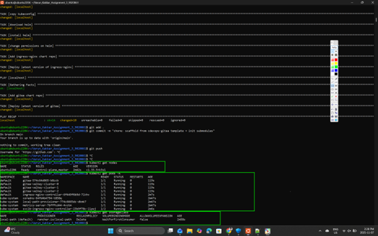
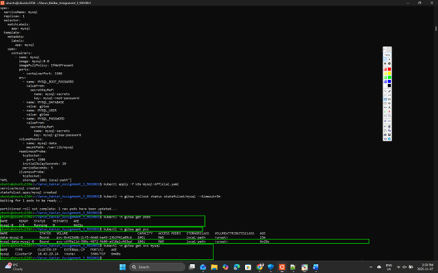
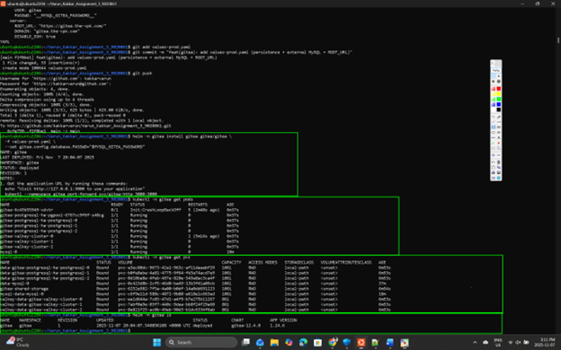
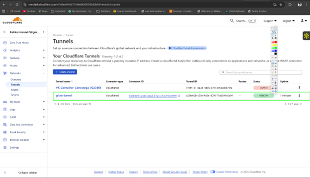
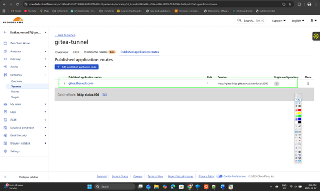
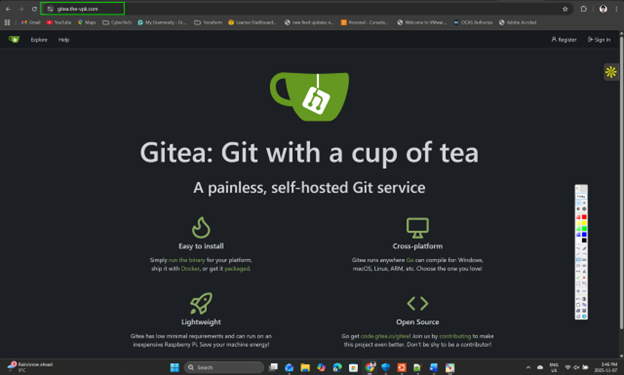
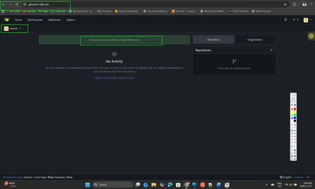
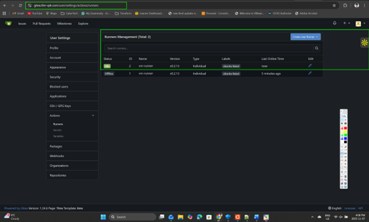

# cdevops-gitea
k8s gitea lab to take dev (sqlite based) to prod (mysql based)

TLDR;

```bash
pip install ansible kubernetes
git submodule update --init --recursive
ansible-playbook up.yml
```

Wait until `kubectl get pod` shows all pods running and:

```bash
kubectl port-forward svc/gitea-http 3000:3000
```

Now you should be able to access gitea in development mode.

The challenge is to run this in production mode.

### Points to Cover

## Marking

|Item|Out Of|
|--|--:|
|use [the gitea helm](https://gitea.com/gitea/helm-gitea) to make the repository data persistent|3|
|make gitea use external database|1|
|Expose your gitea instance publically|3|
|make the README easy to use and ACCURATE|3|
|||
|total|10|


# Assignment 3 — Open-Source CI/CD on Kubernetes with Gitea


**Student:** Varun Kakkar (9020861)  
**Public URL:** `https://gitea.the-vpk.com`  
**Template:** `conestogac-acsit/cdevops-gitea` (this repo created from it)

---


## Architecture (Prod)
Client → Cloudflare (DNS + Tunnel) → cloudflared (Deployment)
→ gitea-http Service:3000 → Gitea Pod (PVCs)
K3s cluster (from template)
└─ gitea namespace
├─ MySQL 8.0 (StatefulSet + PVC 10Gi)
├─ Gitea (Helm) + data/config PVCs
└─ cloudflared (uses tunnel token secret)


---

## Commit Plan (small, intentional)

1. `chore: scaffold from cdevops-gitea template + merge histories`
2. `docs: record initial dev setup per template TLDR`
3. `feat(db): use official MySQL StatefulSet with PVC + Secrets (replaces Bitnami Helm)`
4. `fix(gitea): disable bundled postgres/valkey; external MySQL; persistence; ROOT_URL`
5. `feat(pub): add cloudflared Deployment for Cloudflare Tunnel`
6. `docs: presentational README with steps, fixes, and screenshots`
7. *(in A2 repo on Gitea)* `ci: add basic Docker build workflow for Actions`

---

## Screenshots

### Cluster bring-up


### External DB (MySQL 8.0 with PVC)



### Gitea Helm install (external MySQL + persistence)


### Public exposure via Cloudflare Tunnel



### Gitea accessible + Runner online



---

## Step-by-Step (from zero)

### 0) Prepare repo from template

ssh ubuntu@10.172.27.6    # pwd: 
sudo apt-get update && sudo apt-get install -y git curl python3-pip unzip

git config --global user.name ""
git config --global user.email ""

git clone https://github.com/kakkarvarun/Varun_Kakkar_Assignment_3_9020861.git
cd Varun_Kakkar_Assignment_3_9020861
git remote add template https://github.com/conestogac-acsit/cdevops-gitea.git
git pull template main --allow-unrelated-histories --no-rebase
git push -u origin main

1) Tooling

python3 -m pip install --user ansible kubernetes
export PATH="$HOME/.local/bin:$PATH"
curl -fsSL https://raw.githubusercontent.com/helm/helm/main/scripts/get-helm-3 | bash
curl -fsSL https://get.docker.com | sudo sh
sudo usermod -aG docker $USER && newgrp docker

2) Bring up cluster

git submodule update --init --recursive
ansible-playbook up.yml
kubectl get nodes
kubectl get pods -A
kubectl get storageclass

3) External MySQL with persistence

Tried Bitnami MySQL → Init:ImagePullBackOff.
Fix: official mysql:8.0 StatefulSet + PVC.

kubectl create ns gitea || true
MYSQL_ROOT_PASSWORD=$(openssl rand -base64 24)
MYSQL_GITEA_PASSWORD=$(openssl rand -base64 24)
kubectl -n gitea create secret generic mysql-secrets \
  --from-literal=mysql-root-password="$MYSQL_ROOT_PASSWORD" \
  --from-literal=mysql-gitea-password="$MYSQL_GITEA_PASSWORD"

Deploy k8s-mysql-official.yaml
Apply & verify:
kubectl apply -f k8s-mysql-official.yaml
kubectl -n gitea rollout status statefulset/mysql --timeout=5m

4) Gitea via Helm with external MySQL

First install spawned postgresql-ha + valkey and Gitea stayed Init:CrashLoopBackOff (no endpoints).
Fix: Uninstall and reinstall with all bundled DB/cache disabled, pointing to external MySQL.

prepare values-prod.yaml
Install:
helm repo add gitea https://dl.gitea.com/charts/ || true
helm repo update
MYSQL_GITEA_PASSWORD=$(kubectl -n gitea get secret mysql-secrets -o jsonpath='{.data.mysql-gitea-password}' | base64 -d)
helm -n gitea uninstall gitea || true
helm -n gitea install gitea gitea/gitea -f values-prod.yaml \
  --set gitea.config.database.PASSWD="$MYSQL_GITEA_PASSWORD" \
  --set postgresql.enabled=false --set postgresql-ha.enabled=false \
  --set memcached.enabled=false --set redis.enabled=false \
  --set redis-cluster.enabled=false --set valkey.enabled=false --set valkey-cluster.enabled=false

5) Cloudflare Tunnel → Public URL

Cloudflare Zero Trust → Tunnels → create → copy tunnel token.
Public Hostname: gitea.the-vpk.com → HTTP → http://gitea-http.gitea.svc.cluster.local:3000.

Cluster side:

kubectl -n gitea create secret generic cloudflared-secret \
  --from-literal=tunnel-token='<PASTE_TUNNEL_TOKEN_HERE>'

cat > cloudflared-deployment.yaml <<'YAML'
apiVersion: apps/v1
kind: Deployment
metadata: { name: cloudflared, namespace: gitea }
spec:
  replicas: 1
  selector: { matchLabels: { app: cloudflared } }
  template:
    metadata: { labels: { app: cloudflared } }
    spec:
      containers:
        - name: cloudflared
          image: cloudflare/cloudflared:latest
          args: ["tunnel","--no-autoupdate","run","--token","$(TUNNEL_TOKEN)"]
          env:
            - name: TUNNEL_TOKEN
              valueFrom: { secretKeyRef: { name: cloudflared-secret, key: tunnel-token } }
YAML

kubectl apply -f cloudflared-deployment.yaml
Do not open *.cluster.local in your laptop browser (internal DNS). Use https://gitea.the-vpk.com.

6) First admin

Open https://gitea.the-vpk.com and complete setup / create admin.

7) Actions runner

actions/checkout@v4 failed first with node: not found.
Fix: run runner with Node-capable image.

docker rm -f gitea-runner || true
docker run -d --name gitea-runner \
  -e GITEA_INSTANCE_URL=https://gitea.the-vpk.com \
  -e GITEA_RUNNER_REGISTRATION_TOKEN=<PASTE_RUNNER_TOKEN> \
  -e GITEA_RUNNER_NAME=vm-runner \
  -e GITEA_RUNNER_LABELS="ubuntu-latest:docker://ghcr.io/catthehacker/ubuntu:act-22.04" \
  -v /var/run/docker.sock:/var/run/docker.sock \
  gitea/act_runner:latest

8) Import A2 repo + CI

In Gitea: + → New Migration from https://github.com/kakkarvarun/advance-containers.

.gitea/workflows/ci.yml:

name: CI
on: [push]
jobs:
  build:
    runs-on: ubuntu-latest
    steps:
      - uses: actions/checkout@v4
      - run: |
          node -v || true
          git --version
          docker version
      - uses: docker/setup-buildx-action@v3
      - run: |
          if [ -d ./app ]; then
            docker build -t app:test ./app
          else
            ls -la
          fi
Commit a small README change to trigger CI → should go green.

Issues & Resolutions (quick list)

Git pull divergent histories → used --allow-unrelated-histories --no-rebase.

Bitnami MySQL image pull blocked → switched to official mysql:8.0 StatefulSet + PVC.

Gitea stuck init; no endpoints → disabled bundled Postgres/Valkey; external MySQL only.

Tried *.cluster.local in browser → use public https://gitea.the-vpk.com.

Actions node missing → runner label uses ghcr.io/catthehacker/ubuntu:act-22.04.
